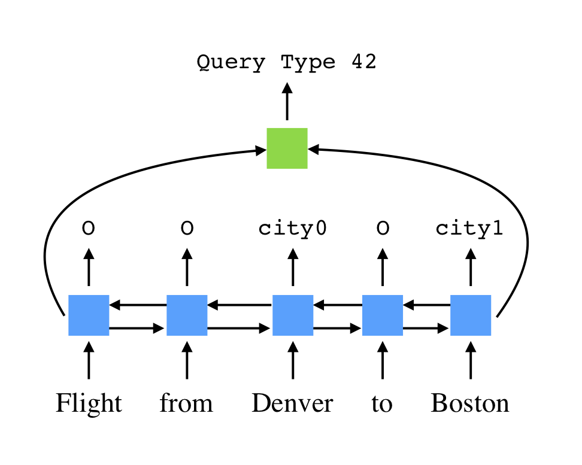

This directory contains a simple baseline approach for mapping text to SQL:

- Identify an SQL template for this question
- Choose words in the question to fill slots in the template

The model uses a bi-directional LSTM to predict a label for each word, indicating what type of slot it fills.
The final hidden states of the LSTM are used to predict the template.
There is no enforcement of agreement between the template and the slots.
Visually, for the sentence "Flights from Denver to Boston" it looks like this:



This approach is motivated by our observation of overlap between train and test in question-based data splits.
It will completely fail on query-based data splits, but does surprisingly well on question-based splits, making it a nice baseline.

If you use this code, please cite our ACL paper:

```TeX
@InProceedings{data-sql-advising,
  author    = {Catherine Finegan-Dollak, Jonathan K. Kummerfeld, Li Zhang, Karthik Ramanathan, Sesh Sadasivam, Rui Zhang, and Dragomir Radev},
  title     = {Improving Text-to-SQL Evaluation Methodology},
  booktitle = {Proceedings of the 56th Annual Meeting of the Association for Computational Linguistics (Volume 1: Long Papers)},
  month     = {July},
  year      = {2018},
  address   = {Melbourne, Victoria, Australia},
  pages     = {},
  url       = {},
}
```

## Requirements

- Python 3
- [Dynet](dynet.readthedocs.io)

## Running

To see all options, run:

```
./text2sql-template-baseline.py --help
```

To run with all the defaults, simply do:

```
./text2sql-template-baseline.py <data_file>
```

## Parameters used for paper results

The parameters were varied slightly for each dataset (any not listed here were set to the default).

Dataset                           | Parameter            | Value
--------------------------------- | -------------------- | ----------
Advising                          | max-iters            | 40
Geography                         | dim-word             | 64
"                                 | dim-hidden-lstm      | 128
"                                 | dim-hidden-template  | 32
"                                 | max-iters            | 31
Scholar                           | lstm-layers          | 1
"                                 | max-iters            | 17
ATIS                              | learning-rate        | 0.05
"                                 | max-iters            | 22
Academic, IMDB, Restaurants, Yelp | dim-word             | 64
"                                 | dim-hidden-template  | 32
"                                 | train-noise          | 0.0
"                                 | lstm-layers          | 1
"                                 | max-iters            | 3

For evaluation, log-freq and eval-freq were set to very large numbers, and do-test-eval was set.

## License

This code is a modified version of the example [tagger code](https://github.com/clab/dynet/blob/master/examples/tagger/bilstmtagger.py) from the DyNet repository.
It is available under an Apache 2 license.

